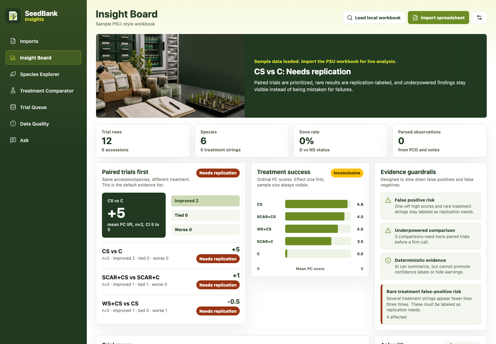

# SeedBank Insights

[](https://github.com/jfleezy23/seedbank-insights/actions/workflows/ci.yml)

SeedBank Insights is a desktop workbench for turning propagation spreadsheets into reviewable seed-bank evidence. It imports accession-level workbook rows, normalizes treatment strings, extracts observation signals from notes, and presents deterministic treatment/species summaries before any AI text is allowed to speak.

The project is built for a careful research workflow: paired comparisons over raw averages, explicit data-quality warnings, confidence labels that do not overstate the evidence, and row-level citations wherever interpretation is generated.

This is an independent project. It is not affiliated with Frame Player, and it does not reuse Frame Player code, assets, release artifacts, or branding.



## What It Does

- Imports PSU-style seed-bank propagation workbooks without committing raw workbook data.
- Registers synced workbook sources, previews every import, and persists changed content as immutable local-database versions.
- Keeps individual and explicitly combined analysis scopes separate; import never silently changes the active scope.
- Quarantines populated rows with missing required analysis fields instead of silently coercing or dropping them.
- Computes treatment, species, trial queue, paired-comparison, and data-quality views locally.
- Leads Species Explorer with matched local treatment effects by species; completed and active evidence, undocumented codes, PC, liner, and 4-inch rootball outcomes remain distinct before optional AI context.
- Preserves raw `PC`, `LPC`, and `4PC` values, using documented 0-5 class cells directly and normalizing exact percentage cells for cross-row analysis.
- Separates seed, stem-cutting, and division outcomes and uses species-clustered paired inference for completed trials.
- Provides a Glossary workspace for workbook-documented treatment acronyms, parser patterns, and local/contextual codes without treating descriptive definitions as statistical eligibility.
- Labels evidence as `Strong signal`, `Promising`, `Inconclusive`, or `Needs replication`.
- Keeps negative treatment effects visible as negative comparisons but does not label them `Promising` or `Strong signal`.
- Supports optional source-backed OpenAI species research and bounded Ask responses from Electron main only.
- Stores OpenAI keys through Electron safe storage; renderer code must not persist keys or use them for OpenAI calls.

## Why It Exists

Propagation workbooks are rich but easy to misread. One high score can look decisive, a cached average can hide uneven sampling, and notes often contain the most useful operational detail. SeedBank Insights is designed to slow that down in the right places:

- evidence before recommendation
- deterministic labels before prose
- row citations before summary claims
- warnings before false confidence

## Project Status

SeedBank Insights is an early desktop prototype. It has real import, analysis, storage, and UI paths, but public releases should be treated as experimental until a signed release notes otherwise.

Current emphasis:

- workbook import reliability
- deterministic statistical guardrails
- safe OpenAI integration
- desktop launch and packaging smoke coverage
- public repository hygiene before first release

## Repository Map

```text
src/                 React UI, deterministic analysis, workbook parsing, sample data
electron/            Electron main/preload, local database persistence, OpenAI IPC boundary
tests/               Unit, integration, UI, and synthetic workbook fixtures
scripts/             Local smoke, packaging, icon, SCA, and secret-scan helpers
assets/branding/     Replaceable prototype branding and generated image assets
docs/                Product, architecture, release, security, and design notes
.github/             CI, dependency review, and pull request templates
```

## Documentation

- [Product overview](docs/product-overview.md)
- [Help](docs/help.md)
- [User guide](docs/user-guide.md)
- [Architecture](docs/architecture.md)
- [Data and AI guardrails](docs/data-and-ai-guardrails.md)
- [Testing strategy](docs/testing-strategy.md)
- [Security and quality baseline](docs/security-quality-baseline.md)
- [Release checklist](docs/release-checklist.md)
- [Roadmap](docs/roadmap.md)
- [Brand notes](docs/brand-notes.md)
- [Security policy](SECURITY.md)
- [License](LICENSE.md)
- [Third-party notices](docs/THIRD_PARTY_NOTICES.md)
- [Contributing](CONTRIBUTING.md)

## Data And Privacy

Raw project workbooks are intentionally ignored by git. Do not commit `P_accessions_new.xlsx`, local PSU-style workbooks, `.env` files, runtime local databases, logs, or generated release output.

The committed fixture at `tests/fixtures/psu-style-accessions-fixture.xlsx` is synthetic and exists so CI can exercise the Excel import path without publishing sensitive source data.

OpenAI is optional. A user-provided API key is validated and stored through Electron main with OS-backed safe storage. Renderer code receives narrow IPC results and must not persist, log, or echo keys.

## Build From Source

Requirements:

- Node.js 22
- pnpm 11
- macOS or Windows for desktop packaging checks

Install and run the main local gate:

```sh
pnpm install
pnpm run secret:scan
pnpm run lint
pnpm run typecheck
pnpm run test
pnpm run build
pnpm run sca
```

For local real-workbook acceptance, keep the raw workbooks outside git and point the tests at your synced copies:

```powershell
$env:WORKBOOK_IMPORT_TEST_PATH = "<local path>\P_accessions_new.xlsx"
$env:READY_WORKBOOK_IMPORT_TEST_PATH = "<local path>\P_accessions_ready.xlsx"
pnpm exec vitest run --reporter=verbose
```

The current v0.4 source acceptance target is: the original workbook imports 128 analyzable trials; the larger workbook recognizes 2,204 populated records, imports 2,166 analyzable rows, exposes 38 quarantined rows, preserves source accession and `D` status, and produces non-empty Advanced Analysis contrasts when completed documented pairs exist.

Run the app in development:

```sh
pnpm run dev
```

Run UI checks:

```sh
pnpm run test:ui
```

Build and launch-smoke a packaged directory:

```sh
pnpm run app:build
pnpm run app:smoke
```

`pnpm run app:build` creates an unpacked packaged app for human review, such as `release/win-unpacked/SeedBank Insights.exe` on Windows. Packaging is not launch verification. Before calling desktop work complete, run the packaged app bundle/executable and inspect evidence that the main window, splash, icon resources, and first screen render correctly.

Do not build or attach installer artifacts such as the Windows NSIS setup executable for review checkpoints. Installer packaging is release-only and requires explicit approval after human testing passes.

## Maintainer Checklist

Before pushing public code or opening a release PR:

```sh
git status --short
pnpm run secret:scan
pnpm run lint
pnpm run typecheck
pnpm run test
pnpm run test:ui
pnpm run db:smoke
pnpm run build
pnpm run sca
pnpm run app:build
pnpm run app:smoke
```

Inspect the diff before committing and keep validation notes with the change. Release-impacting changes also need a read-only AGY review with Gemini 3.5 Flash High, adjudication of every comment, and explicit human-test approval before merge, tag, upload, or release.

## License

SeedBank Insights is provided under the evaluation license in [LICENSE.md](LICENSE.md). The grant is limited to PSU Seed Bank testing, review, and evaluation unless a separate written agreement says otherwise.
